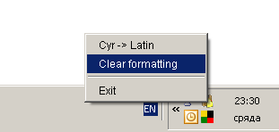
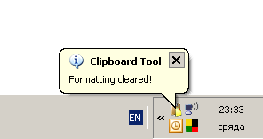
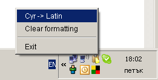
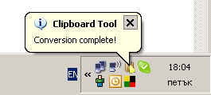
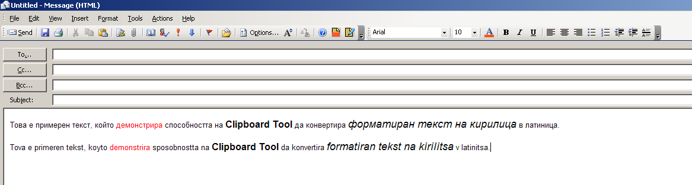
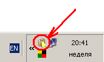
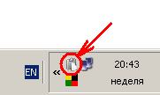
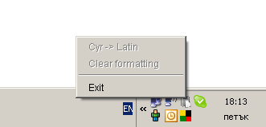

Clipboard Tool
==============

This is a project I initially [shared on Sourceforge](https://sourceforge.net/projects/clipboard-tool/) several years ago.

This tool requires Java 1.6, due to the system tray support and has two main features:
  * Transliteration from and to cyrillic text (i.e. if you are concerned that the cyrillic characters might not be displayed on the recepient's side)
  * Removal of formatting from the text in the clipboard (so that you can paste is as plain text and to allow it to adopt the format of the destination document)

The tool detects the content of the clipboard and becomes inactive if the clipboard is empty, or if non-text element is copied (like a file, for example).

I guess it could be useful if you are interested in working with the system tray from Java and/or handle text in the clipboard.

Screenshots
===========
 &nbsp;
 &nbsp;
 &nbsp;
 &nbsp;
 &nbsp;
 &nbsp;
 &nbsp;
 &nbsp;
